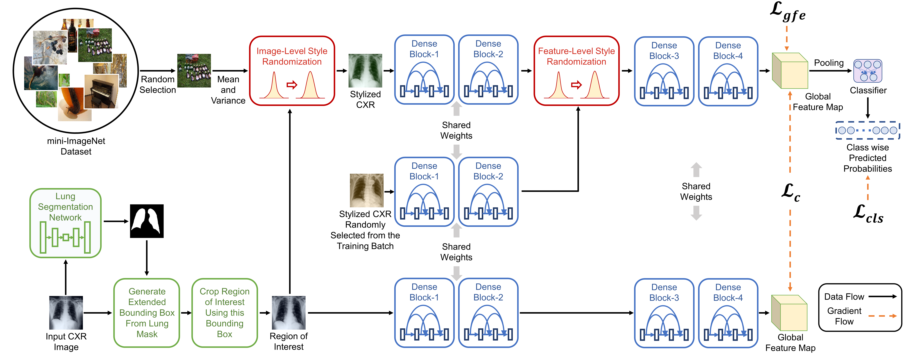

# Learning to Generalize towards Unseen Domains via a Content-Aware Style Invariant Framework for Disease Detection from Chest X-rays [[ArXiv Paper]()]
By Mohammad Zunaed, Md. Aynal Haque, Taufiq Hasan



# Prepare Data
- Download the full-size [Standford CheXpert](https://stanfordaimi.azurewebsites.net/datasets/8cbd9ed4-2eb9-4565-affc-111cf4f7ebe2), [MIMIC-CXR-JPG](https://physionet.org/content/mimic-cxr-jpg/2.0.0/), and [BRAX](https://physionet.org/content/brax/1.1.0/) datasets.
- Change the datasets paths of the downloaded datasets in the following files: /datasets/process_brax.py, /datasets/process_chexpert.py, and /datasets/process_mimic.py. Then, run:
```
sh prepare_data.sh
```
- Download the datasets from [here]() and place them under /lung_segmentation_network/datasets/  for training the lung segmentation network.
```
├── lung_segmentation_network/
│   ├── datasets/     
|   |   ├── jsrt/
|   |   ├── jsrt_gt/
|   |   ├── ranzcr_clip/
|   |── ├── ranzcr_clip_gt/			
...
```
